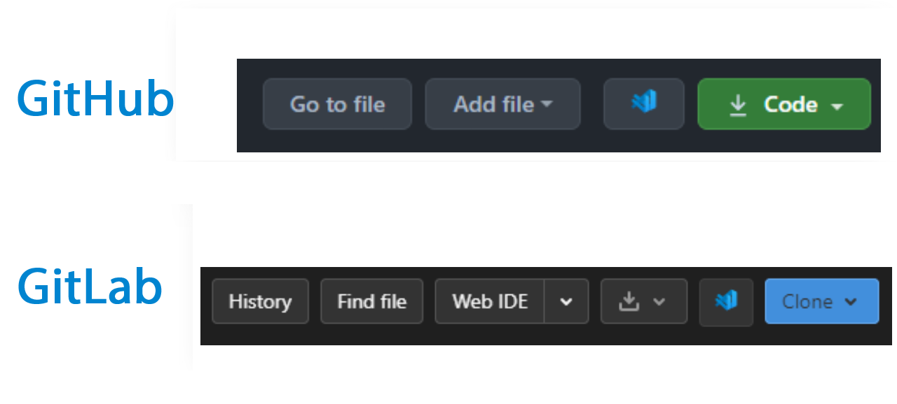

# clone-with-vscode

## Install

Drag and drop src into chrome://extensions/

## Intro

Add a button that click will open Visual Studio Code and clone the repository.

Support GitHub / Gitee / GitLab.

## Preview

## License

MIT © [ayce45](https://github.com/ayce45)
